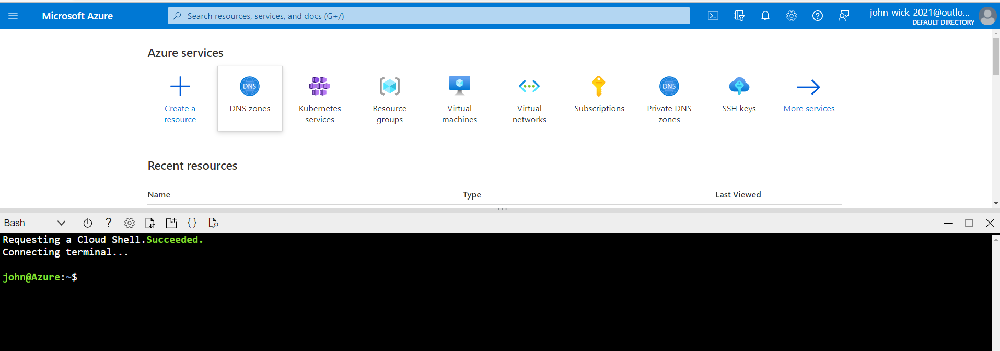

#  Explore Kubernetes Cluster 


Verify your System for Kubernetes
# Step 1 

Access Azure Cloud Shell and Connect to AKS

- Initiate Azure Cloud Shell ( you may be asked to create storage account when you run Azure Cloud Shell for First time, accept the default)

- Select Bash if prompted 

  


```sh
User@Azure#> az account set --subscription $(az account list | grep id | awk '{print $2}'  | sed 's/"//g' | sed 's/,//g')

User@Azure#> az aks get-credentials --resource-group aks_rg --name aks_lab

User@Azure#> kubectl get nodes 

User@Azure#> kubectl get nodes -o wide

User@Azure#> kubectl top nodes
```

# Step 2 

Open a SSH connection to worker node
 - replace node_name with your worker node name 
```sh
User@Azure#> kubectl get nodes 

User@Azure#> kubectl debug node/<node_name> -it --image=mcr.microsoft.com/aks/fundamental/base-ubuntu:v0.0.11
 
```

# Step 3 

Make sure docker is installed on all 3 system 
```sh
master#> docker -v 
node1#> docker -v 
node2#> docker -v 
```

# Step 4 

Open SSH session from master to node1 and node2 in terminal 
```sh
master#> ssh node1.example.local 
master#> ssh node2.example.local 
```

# Step 5
# Init Kubernetes <br>
Perform kubeadm init on master <br>

```sh
master#> kubeadm init 
```

# Step 6
Copy the kubeadm join output and run it in node1 and node2 


# Step 7
Enable kubectl command  
```sh

mkdir -p $HOME/.kube
cp -i /etc/kubernetes/admin.conf $HOME/.kube/config
chown $(id -u):$(id -g) $HOME/.kube/config
```

# Step 8 
Verify with kubectl command in master.example.local 
```sh
 kubectl get po -n kube-system
 kubectl get node -o wide 
```

# Step 9 
Deploy the Weave Net cni in master.example.local
 
```sh
kubectl apply -f "https://cloud.weave.works/k8s/net?k8s-version=$(kubectl version | base64 | tr -d '\n')"
```

# Step 10 
Verify with kubectl command in master.example.local 
```sh
 kubectl get po -n kube-system
 kubectl get node
```

# Enable kubectl autocompletion 
```sh
echo 'source <(kubectl completion bash)' >>~/.bashrc

kubectl completion bash >/etc/bash_completion.d/kubectl

echo 'alias k=kubectl' >>~/.bashrc
echo 'complete -F __start_kubectl k' >>~/.bashrc
```
Restart (logoff/logon) shell session for kubectl autocompletion activation 

END